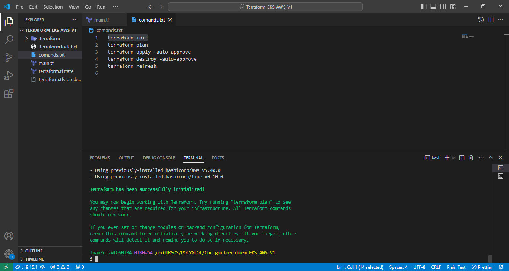

# polyglot_homework
- STEP 1
    aws configure in terminal

- STEP 2
    terraform init

    

- STEP 3
    terraform Plan

    

- STEP 4
    terraform apply -auto-approve

    

- STEP 5
    view cluster eks and nodes in aws consoles

    

- STEP 6
    terraform destroy -auto-approve

    